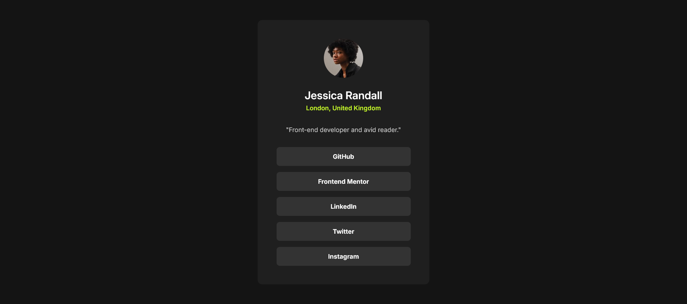

# Frontend Mentor - Social links profile solution

This is a solution to the [Social links profile challenge on Frontend Mentor](https://www.frontendmentor.io/challenges/social-links-profile-UG32l9m6dQ). Frontend Mentor challenges help you improve your coding skills by building realistic projects.

## Overview

### Screenshot

### Links

- Live Site URL: [vercel.app](https://frontendmentor-social-links.vercel.app/)

## My process

### Built with

- Semantic HTML5 markup
- TailwindCSS
- Flexbox

### What I learned

xxx

### Useful resources

- [TailwindCSS](https://www.tailwindcss.com) - TailwindCSS documentation.

## Author

- Frontend Mentor - [@wall-69](https://www.frontendmentor.io/profile/wall-69)
